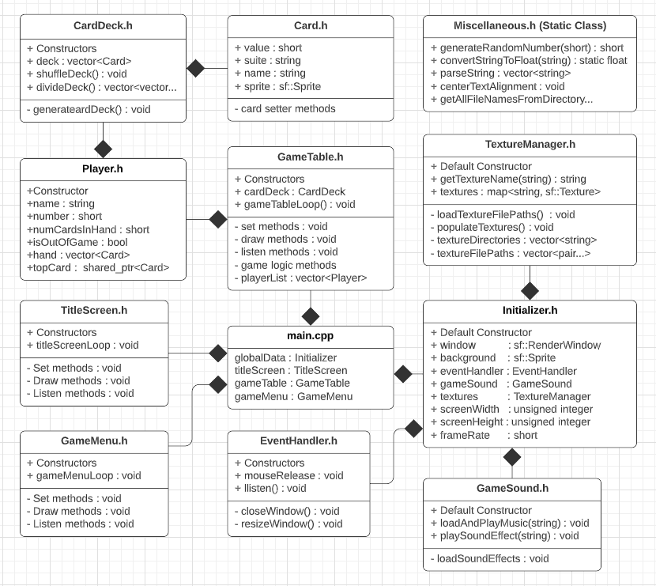

<h1>Card Game Framework</h1>

<b>DESCRIPTION:</b>

This repository is a framework for making a card game in C++ using SFML. This framework contains
   the necessary classes to load playing card images, manage textures, set sound and music, access
   and use mouse and joystick controls, and several other various functions like generating random
   numbers and reading files from folders.

<b>DEPENDENCIES:</b>
<ul><li>C++ 11</li>
    <li>SFML (Get it here: https://www.sfml-dev.org/index.php)</li></ul>

<b>COMPILE INSTRUCTIONS (CMake):</b>
<ol><li>Create "Build" folder in the code directory</li>
    <li>Change directory into the "Build" folder</li>
    <li>Run command: '<b>cmake ..</b>' (auto configure) or '<b>ccmake ..</b>' (for manual configuring)  
    	If manual, configure anything needed but you should only need to add "Debug" to the blank line.
        Enter "c" to create a cmakeList.txt file. Enter "g" to finish generating and exit the gui.</li>
    <li>After the cmake files have been generated in the "Build" folder, run the command: '<b>make</b>'. 
        This will create a "Main.out" executable file in the source folder.</li>
    
*Note: Only step 4 will be needed for repeat compiles once the Build folder is created and 
        initialized. There are also scripts to assist with compiling and cleaning garbadge files.
</ol>

<b>COMPILE INSTRUCTIONS (g++):</b>
    
If CMake isnt working, you can use the 'compileAndRun.bash' script. Just run as is.

<b>UML DIAGRAM</b>

