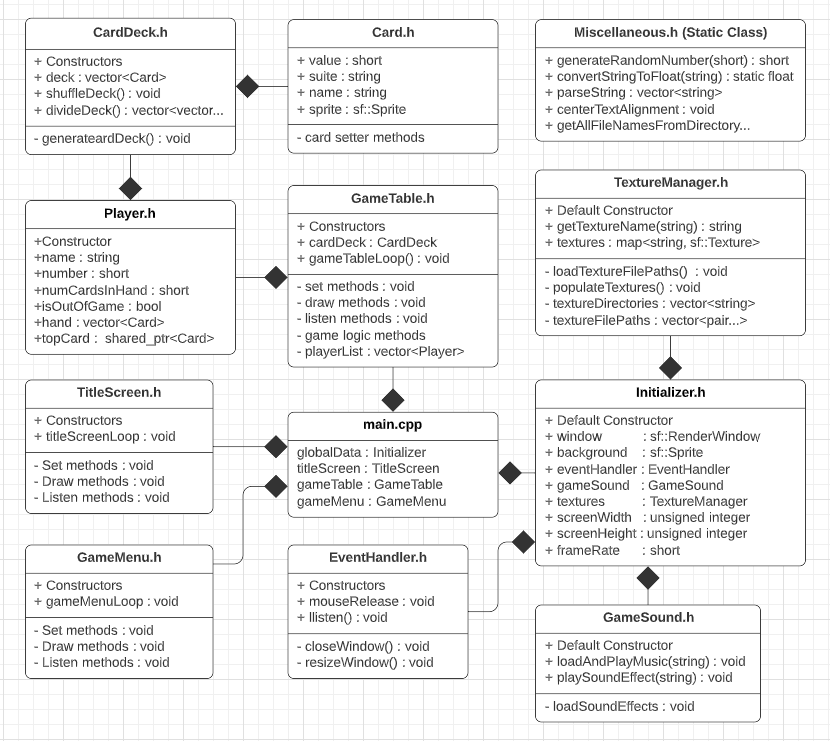

<h1>War Card Game</h1>

<b>DESCRIPTION:</b>

This is a very simple card game that most of us know as "War". Two or more cards are compared. The player who places the highest card wins all lower cards. Acquiring all cards wins the game (I discovered that most 1-on-1 games usually result in an infinite loops and cannot be won). The top left-most card was intended to be the human player, but since there is little more involvement than clicking the card, I decided not to make a big deal about identifying players.

My purpose in making this game was to study and apply coding architecture techniques. This project is a preamble to other projects I intend work on and  helped me to figure out what kind of code organization works and what does not. After playing the game, you may agree that the settings menu is more fun than the game itself, but making a fun game was not the point. Now that I know how things work, I can move forward and make card games and other genres of games that are actually fun to play while not spending so much time figuring out the logistics and mechanics of the framework. I made an effort to code as cleanly as possible and will admit that this project is a good representation of what anyone can expect of me as a software engineer.

<b>SCREENSHOTS:</b>
  
<image src="Images/Screenshot.png"></image>

<b>DEPENDENCIES:</b>
<ul><li>C++ 11</li>
    <li>SFML (Get it here: https://www.sfml-dev.org/index.php)</li></ul>

<b>COMPILE INSTRUCTIONS (CMake):</b>
<ol><li>Create "Build" folder in the code directory</li>
    <li>Change directory into the "Build" folder</li>
    <li>Run command: '<b>cmake ..</b>' (auto configure) or '<b>ccmake ..</b>' (for manual configuring)  
    	If manual, configure anything needed but you should only need to add "Debug" to the blank line.
        Enter "c" to create a cmakeList.txt file. Enter "g" to finish generating and exit the gui.</li>
    <li>After the cmake files have been generated in the "Build" folder, run the command: '<b>make</b>'. 
        This will create a "Main.out" executable file in the source folder.</li>
    
*Note: Only step 4 will be needed for repeat compiles once the Build folder is created and 
        initialized. There are also scripts to assist with compiling and cleaning garbadge files.
</ol>

<b>COMPILE INSTRUCTIONS (g++):</b>
    <ul><li>If CMake isnt working, you can use the 'compileAndRun.bash' script. Just run as is.</li></ul>

<b>UML DIAGRAM:</b>

